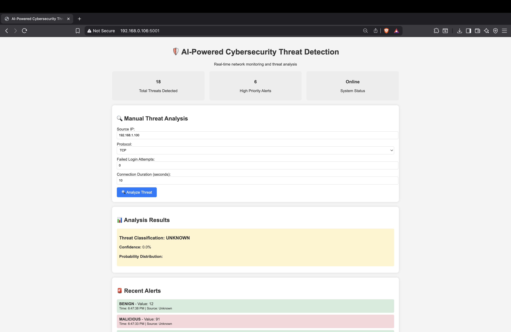
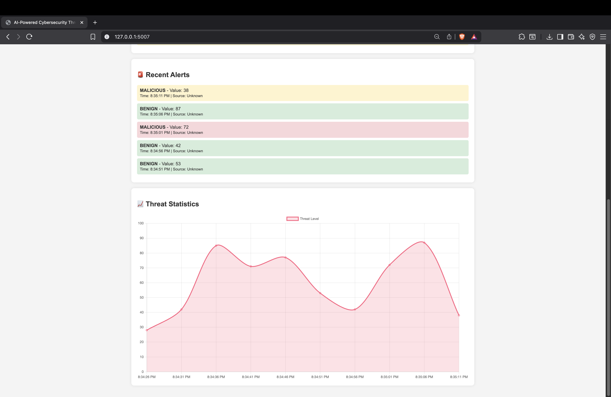
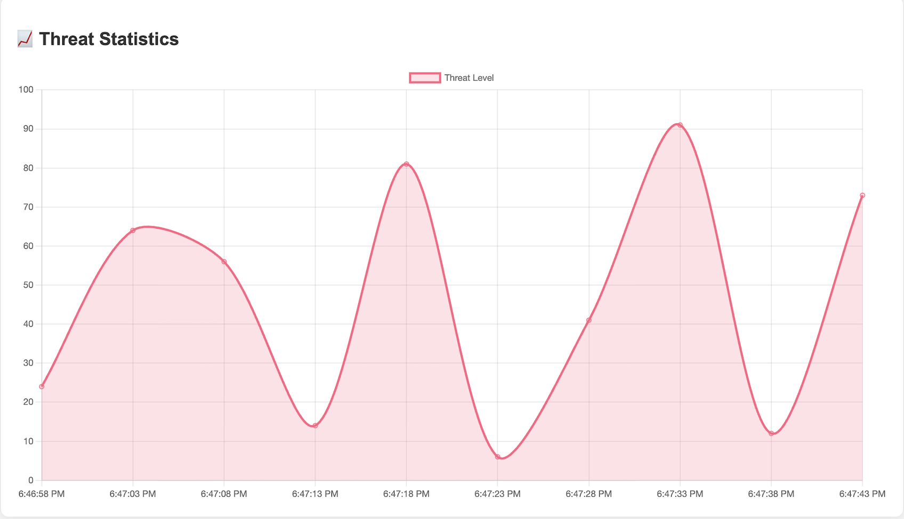
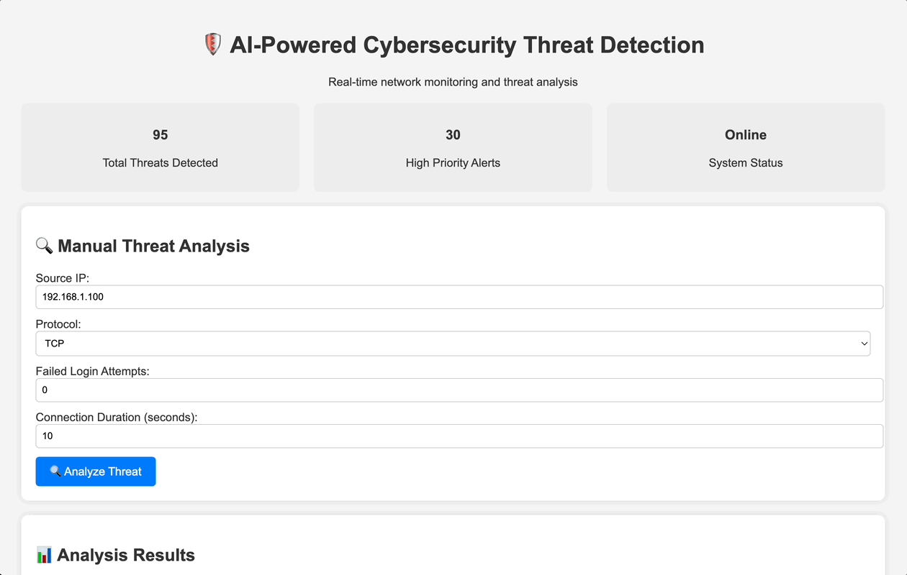
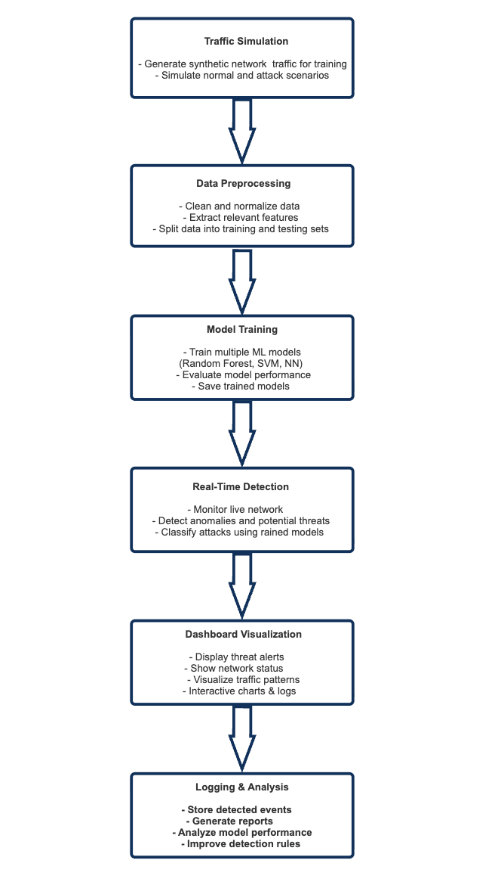

# 🛡️ Cybersecurity Threat Detection System

[](https://www.python.org/)
[](https://palletsprojects.com/p/flask/)
[](LICENSE)
[](https://github.com/Manojgowda898/cybersecurity_threat_detection)

An **AI-powered cybersecurity threat detection system** designed to identify and classify potential network threats in real-time. This project combines **machine learning, network traffic simulation, and a live monitoring dashboard** to demonstrate how AI can enhance cybersecurity.

---

## 📖 Project Explanation

In today’s digital world, organizations face constant threats such as malware, phishing, denial-of-service (DoS) attacks, and intrusion attempts. Traditional security systems rely heavily on predefined rules and signatures, which often fail against new or unknown attack patterns.

This project aims to tackle that problem by building an **AI-driven threat detection system**.

### 🔹 Core Idea

Instead of only checking for known attack signatures, we train **machine learning models** on network traffic data to learn the difference between normal and malicious activities. Once trained, the system can flag suspicious activity in real-time.

### 🔹 How It Works

1. **Data Simulation** – The system generates synthetic network traffic (both normal and malicious).
2. **Model Training** – ML models (Random Forest, SVM, Neural Network) are trained to classify traffic.
3. **Real-Time Detection** – The system continuously monitors incoming traffic and uses trained models to detect threats.
4. **Dashboard Visualization** – A live Flask + SocketIO dashboard shows ongoing activities, alerts, and logs.
5. **Database Logging** – All detected threats are stored in an SQLite database for later analysis.

### 🔹 Why It’s Useful

- Demonstrates the **power of AI in cybersecurity**.
- Provides a **hands-on simulation** of modern security systems.
- Can be extended to use **real-world datasets** and integrated with live packet sniffers like Scapy/Wireshark.

---

## 📂 Project Structure
```
cybersecurity_threat_detection/
│── app.py                  # Flask app (backend server & routes)
│── train_models.py         # Train ML models on synthetic/real data
│── network_simulator.py    # Simulate network activities
│── simulate_traffic.py     # Generate synthetic threat traffic
│── run_system.py           # Run the entire detection system
│
├── models/                 # ML model definitions
│   └── threat_model.py
├── models_saved/           # Saved trained models
├── templates/              # Frontend templates
│   └── dashboard.html
├── static/                 # Frontend assets
│   ├── js/
│   │   └── dashboard.js
│   └── css/
│       └── style.css
├── database/               # Local database
│   └── threats.db
├── requirements.txt        # Dependencies
├── LICENSE                 # MIT License
└── README.md               # Project documentation
```

---

## 🚀 Features

- Real-time threat detection
- Simulation of network traffic (normal vs malicious)
- Multiple ML models (Random Forest, SVM, Neural Network)
- Flask backend with SocketIO for live updates
- Interactive dashboard (HTML + CSS + JS)
- SQLite database for logging detected threats

---

## 🛠️ Tech Stack

- **Backend**: Flask, Flask-SocketIO
- **Machine Learning**: scikit-learn, TensorFlow/PyTorch
- **Frontend**: HTML (Jinja2 templates), CSS, JavaScript
- **Database**: SQLite
- **Others**: Pandas, NumPy, Matplotlib

---

## ⚡ Installation Guide

```bash
git clone https://github.com/Manojgowda898/cybersecurity_threat_detection.git
cd cybersecurity_threat_detection
python -m venv .venv
source .venv/bin/activate   # On Windows use .venv\Scripts\activate
pip install -r requirements.txt
```

---

## ▶️ How to Run

### 1. Train Models

```bash
python train_models.py
```
> Trained models will be saved in `models_saved/`.

### 2. Simulate Traffic

```bash
python simulate_traffic.py
```
> Generates synthetic normal and malicious network packets.

### 3. Run Full System

```bash
python run_system.py
```
> This runs the simulator + detection + dashboard.

### 4. Start Web Dashboard

```bash
python app.py
```
> Then open: [http://127.0.0.1:5000](http://127.0.0.1:5000)

---

## 🎥 Demo

- **Web Dashboard**


- **Threat Classification**


**Example:**
- **Training Logs**

```
Training random_forest...
Accuracy: 100%
Training svm...
Accuracy: 95.3%
Training neural_network...
Accuracy: 98.7%
✅ Models trained and saved in 'models_saved/'
```
## 📊 Model Accuracy

| Model           | Accuracy |
|-----------------|----------|
| Random Forest   | 100%     |
| SVM             | 95.3%    |
| Neural Network  | 98.7%    |

**Training Logs (Terminal Output):**  


**Model Accuracy Graph:**  


**Project Demo**


---

## 🔄 Workflow
**Traffic Simulation → ML Model Training → Real-Time Detection → Dashboard Alert**


---

## 🌱 Future Improvements

- Add live packet capture (Wireshark/Scapy integration)
- Deploy with Docker and Kubernetes
- Use real-world datasets (CICIDS, NSL-KDD, etc.)
- Extend dashboard with graphs & analytics

---

## 📜 License

This project is licensed under the **MIT License** – see the [LICENSE](LICENSE) file for details.

---

## 🤝 Contributing

Contributions are welcome! Please read our [Contributing Guidelines](CONTRIBUTING.md) before submitting issues or pull requests.


---

## 🙌 Acknowledgements

- scikit-learn team for ML algorithms
- TensorFlow/PyTorch community
- Flask-SocketIO developers
- CICIDS / NSL-KDD datasets (planned future use)

